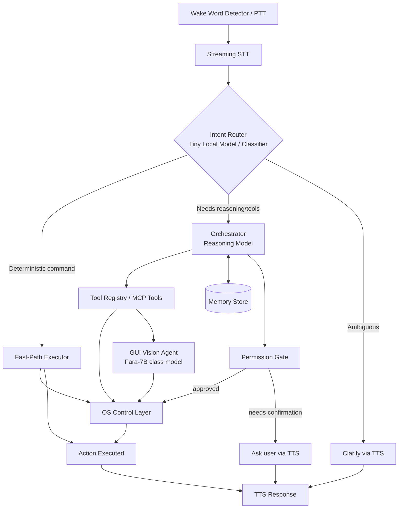

# AGENTS.md — Laya (JARVIS-Style Voice Desktop Assistant)

> **Purpose:** This document is the primary instruction set and architectural blueprint for AI agents working in this repository. All implementations, refactors, and feature additions must strictly adhere to the patterns, constraints, and phase boundaries defined here.

---

## 1. System Vision & Design Goals

Laya is a local-first desktop assistant that accepts voice commands and executes real actions on the machine — app lifecycle, volume/hardware control, window management, email drafting, scheduling, and general computer task execution — with **latency as a first-class constraint**.

| Goal | Architectural Rule & Impact |
|---|---|
| **Sub-300ms for Simple Commands** | "Raise the volume," "close this," "open Spotify" **must never wait on a multi-second LLM round trip**. These require a fast-path executor that bypasses LLMs entirely. |
| **Genuinely Open-Ended Tasks** | "Draft an email to my landlord about the leak and find a time next week to call him" uses an orchestrator with reasoning, tool chaining, and durable memory. |
| **Control Apps with No API** | Software lacking automation APIs is controlled through hybrid tiers: try UI Automation (UIA) tree first, fall back to screen-grounded vision actions (Fara-7B / UFO2 style) last. |
| **No Accidental Destruction** | Every action must pass an explicit Permission Gate (Green / Yellow / Red). Destructive actions require confirmation that cannot be bypassed. |
| **Local-First Architecture** | Always-on listening and fast-path execution are local. Heavy reasoning may optionally fall back to a cloud model when configured. |
| **Durable Memory** | Store and retrieve user preferences, facts, and state (Mem0-style) across sessions rather than relying solely on the context window. |

---

## 2. High-Level Architecture & Execution Paths

Every user utterance is routed into one of **three execution paths**:

1. **Fast Path (<300ms)**: Deterministic system commands. No LLM inference. Direct OS API / Win32 / UIA dispatch.
2. **Reasoning Path**: Orchestrator model plans, queries memory, executes structured tools (Tier 1 API or Tier 2 MCP), checks permission gates, and handles complex multi-step tasks.
3. **Vision Fallback Path**: Screen-grounded action loop (screenshot → ground → act → observe) reserved exclusively for apps with no API and no accessibility tree. Visibly and audibly flagged to the user due to inherent latency.

---

## 3. Core Component Specifications

### 3.1 Wake Word + Audio Capture
- **Always-on engine**: Lightweight on-device wake-word detector (openWakeWord / Porcupine class). Only this component runs continuously.
- **Push-to-Talk (PTT)**: Development and noisy-environment fallback.
- **Voice Activity Detection (VAD)**: Dynamic energy or Silero VAD to detect speech termination without waiting on fixed timeouts.

### 3.2 Speech-to-Text (ASR)
- **Local Streaming STT**: `faster-whisper` or streaming-optimized local ASR.
- **Latency target**: Partial transcript within ~200ms of speech onset; final transcript within ~300ms of speech end.
- **Cloud STT fallback**: Optional hosted API for long voice dictation tasks where accuracy supercedes latency.

### 3.3 Intent Router (The Instant Layer)
- **Role**: Purpose-trained tiny classifier or small function-calling model (e.g. FunctionGemma-270M class) running in single-digit milliseconds on CPU.
- **Decisions**:
  - **Deterministic command** → Dispatch immediately to Fast-Path Executor.
  - **Reasoning / multi-step task** → Hand off to Orchestrator.
  - **Ambiguous input** → Trigger immediate clarifying question via TTS.

### 3.4 Orchestrator & Model Serving
- **Execution loop**: Plan → call tool(s) → observe result → iterate or synthesize final response.
- **Model swap layer** (e.g. `llama-swap` / proxy):
  - Keeps the tiny router model resident in memory.
  - Dynamically loads/unloads reasoning and vision models to respect single-machine VRAM constraints.
- **Configurable cloud fallback**: Support hosted APIs (Groq, Anthropic, OpenAI) for heavy reasoning when enabled by config.

### 3.5 Tool Execution Layer (Tiered)
- **Tier 1 (Native / Direct API)**:
  - Calendar APIs, email drafting/sending, Win32 hardware calls (volume, brightness, lock, power), native document creation.
- **Tier 2 (OS Automation / MCP-Based)**:
  - Exposes OS primitives via MCP tools: `launch_app`, `list_windows`, `close_window`, `query_uia_tree`, `click_element`, file CRUD.
  - **Dynamic tool discovery**: Agent receives a core toolset + `search_tools(query)` to avoid prompt context bloat and over-tooling degradation.

### 3.6 GUI Vision Fallback Agent
- Screen-grounded action model (Fara-7B / UFO2 style) driving mouse/keyboard as a human user.
- **Strict condition**: Used **only** as a last resort when neither Tier 1 APIs nor Tier 2 UIA accessibility trees expose the target controls.
- Must announce execution ("I'll need to click through this manually, one moment") so latency is transparent.

### 3.7 Memory System
- **Working Memory**: Current task context inside the orchestrator window; cleared upon task completion.
- **Episodic / Preference Memory (Mem0-style)**: Durable extracted facts ("prefers meetings after 10am", "landlord is Marcus"). Deduplicated and retrieved via semantic similarity.
- **Task / State Memory**: Active reminders and multi-step state tracking requiring explicit read/write semantics.

### 3.8 Permission & Safety Gate
All actions are strictly categorized at definition time:
- **Green (Auto-Execute)**: Volume adjustments, app launching, reading calendar, system metrics, non-destructive queries.
- **Yellow (Confirm Once / Remember)**: Sending emails, creating calendar events, modifying non-critical settings.
- **Red (Explicit Confirmation Every Time)**: System shutdown/restart, permanent file deletion, disk partitioning, payment actions.
  - *Constraint*: Red actions require explicit vocal repeat-back verification or physical keypress confirmation to prevent STT misinterpretation hazards.

### 3.9 Text-to-Speech (TTS)
- **Local Engine (SAPI5 / Piper)**: Sub-50ms latency for short acknowledgments, fast-path confirmations, and clarifying questions.
- **High-Quality Engine**: Cloud or neural TTS for long dictation reading or comprehensive responses.

---

## 4. Command Taxonomy Reference

| Command Pattern | Execution Path | Target Layer |
|---|---|---|
| "Raise the volume" / "Mute" | Fast Path | Router → Win32 Audio API |
| "Close this window" | Fast Path | Router → Window Manager API |
| "Open Spotify" | Fast Path | Router → App Launcher (`launch_app`) |
| "Shut down the computer" | Fast Path (Red-Tier) | Router → Permission Gate → User Confirmation → OS Power |
| "Schedule a call with Marcus next week" | Reasoning Path | Orchestrator → Memory Lookup → Calendar API → Confirmation |
| "Write an email to my landlord about the leak" | Reasoning Path | Orchestrator → Memory Lookup → Email Draft → Confirmation |
| "Turn off notifications in [app without API]" | Vision Fallback | Orchestrator → Tool Search (none) → Vision Grounding Loop |
| "What did I ask you to remember yesterday?" | Reasoning Path | Orchestrator → Memory Store Query |

---

## 5. Phased Roadmap Guidelines for Agents

When implementing or extending Laya, work sequentially through the following phases:

### Phase 0: Environment & Scaffolding
- Set up local model serving proxy behind an OpenAI-compatible interface.
- Establish clean Audio Pipeline: Wake Word → Dynamic VAD → Streaming STT → Console verification.
- **Milestone**: Reliable, low-latency audio capture and accurate live transcription under load.

### Phase 1: Fast-Path Deterministic Commands
- Build lightweight intent classifier / router.
- Implement OS Control Layer (volume, mute, app launch/close, lock, screenshot).
- **Milestone**: Deterministic commands execute in <300ms without LLM invocation.

### Phase 2: Reasoning Path & Core Tier 1 Tools
- Wire orchestrator reasoning engine with model swap support.
- Implement Tier 1 API tools (email drafting, calendar integration).
- Implement Green/Yellow/Red Permission Gate.
- **Milestone**: "Draft an email about X" works end to end with user confirmation before dispatch.

### Phase 3: OS Automation Tools (Tier 2 / MCP)
- Expose OS primitives via standardized MCP tools (window control, process listing, UIA tree inspection).
- Implement dynamic tool search to prevent over-tooling.
- **Milestone**: "Open [app] and click the second tab" functions via accessibility inspection without bespoke code.

### Phase 4: Durable Memory Store
- Implement Mem0-style extracted-fact persistence.
- Wire orchestrator to query and persist user preferences and contacts.
- **Milestone**: Assistant recalls facts from earlier sessions without re-prompting.

### Phase 5: Vision Fallback Agent
- Integrate compact screen-grounded vision model (Fara-7B class).
- Implement screenshot capture (`mss`) -> element grounding -> input simulation loop.
- **Milestone**: Completes GUI tasks in apps lacking both APIs and accessibility trees.

### Phase 6: Hardening, Safety & Polish
- Tune wake word sensitivity and false-positive rejection.
- Implement repeat-back / physical confirmation for Red-tier actions.
- Benchmark and optimize model swapping latencies and audio response speed.

---

## 6. Development & Coding Rules for Agents

1. **Latency Budgets**:
   - Fast path must execute in **<300ms**.
   - Do not inject LLMs into trivial system controls.
2. **Never Block the Main Loop**:
   - Audio listening, VAD, and user interfaces must remain non-blocking and responsive.
   - Network calls to external APIs must have strict timeouts (≤1.0s) and fallback to local equivalents.
3. **No Brittle Hacks**:
   - Do not rely on hardcoded sleep timers or fixed pixel coordinates for GUI actions.
   - Use UIA element identifiers or grounded bounding boxes with verification.
4. **Safety Compliance**:
   - Never bypass the Permission Gate for Yellow or Red actions.
5. **Clean Repository State**:
   - Keep `.env`, temporary recordings, logs, and `__pycache__` excluded from git tracking.
